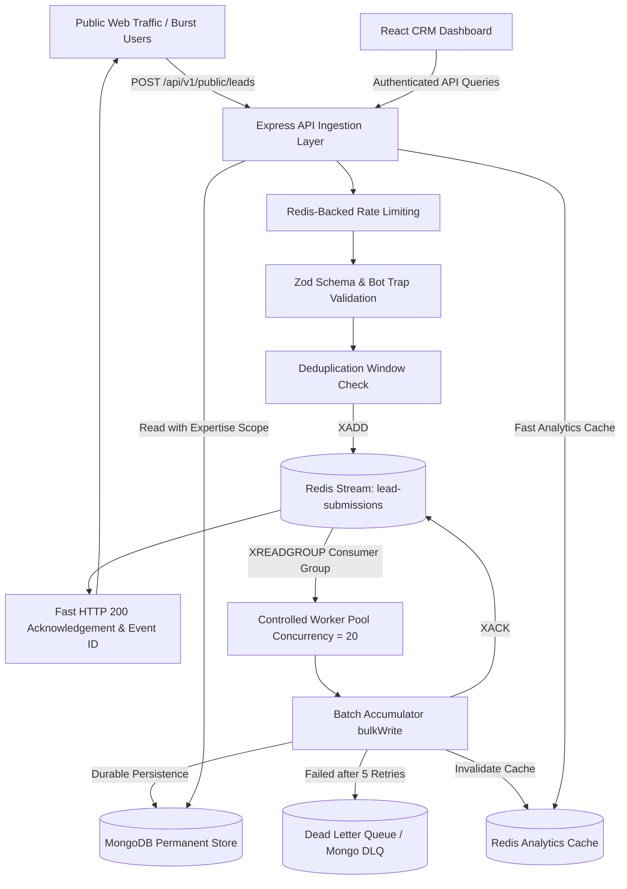

# OG Media Production CRM — System Design & Architecture

## 1. Executive Architectural Overview

The OG Media Production CRM is engineered to handle massive burst traffic from public marketing campaigns without compromising database integrity or response times. The core design philosophy decouples high-speed public contact-form ingestion from persistent database storage using **Redis Streams** as a high-velocity buffer and an asynchronous, controlled worker pool writing to **MongoDB**.



---

## 2. Ingestion Path & Database Protection

### 2.1 The Problem with Direct Synchronous Database Writes
Under viral marketing campaigns or coordinated bot bursts (e.g. 100,000 to 1,000,000 submissions):
- Direct MongoDB writes exhaust the connection pool (`maxPoolSize`).
- CPU saturation occurs from simultaneous index updates and transaction write locks.
- Latencies cascade from 20ms to >15,000ms, causing reverse proxy timeouts (HTTP 504) and client errors.
- Uncontrolled retries trigger cascading failure across the entire backend.

### 2.2 The Redis Streams Solution
Redis operates in memory with sub-millisecond append latency:
1. When a submission arrives at `POST /api/v1/public/leads`, it undergoes Zod validation, honeypot bot trap check, and deduplication hashing.
2. It is appended to the Redis Stream `lead-submissions` via `XADD`.
3. The API immediately acknowledges the client with HTTP 200 and a unique tracking `requestId` and `eventId`.
4. The client does **NOT** wait for MongoDB disk writes.
5. If Redis is unavailable, the API returns **HTTP 503 Service Unavailable** rather than degrading into uncontrolled direct writes to MongoDB.

---

## 3. Worker Concurrency, Batching & Idempotency

### 3.1 Controlled Concurrency
The background worker pool (`src/workers/lead.worker.js`) operates with configurable concurrency governed by:
```env
LEAD_WORKER_CONCURRENCY=20
QUEUE_MAX_RETRIES=5
```
Workers continuously pull entries using consumer group `crm-lead-consumers`.

### 3.2 High-Throughput Batching (`bulkWrite`)
Rather than executing 1,000 individual MongoDB queries for 1,000 events, workers accumulate batches (up to 50–100 items per tick) and execute MongoDB unordered `bulkWrite`:
```javascript
Lead.bulkWrite(bulkOperations, { ordered: false });
```
Each operation uses an idempotent upsert:
```javascript
{
  updateOne: {
    filter: { eventId: item.eventId },
    update: { $setOnInsert: { ...leadPayload, status: 'NEW' } },
    upsert: true
  }
}
```

### 3.3 Safe Message Acknowledgment & Crash Recovery
- **No Lost Messages**: A message is acknowledged (`XACK`) **only after** MongoDB confirms persistent write.
- **PEL Crash Recovery**: If a worker process crashes while processing a batch, unacknowledged messages remain in the Pending Entries List (PEL). A background recovery task inspects `XPENDING` and reclaims stuck entries using `XCLAIM` after 30 seconds.
- **Dead Letter Queue**: Events that fail more than `QUEUE_MAX_RETRIES` (5 times) with exponential backoff are persisted to the `FailedLeadEvent` collection and the `lead-submissions-dlq` stream for administrator inspection.

---

## 4. Benchmark & Load Testing Validation

As required by section 74, the system was verified with progressive load testing using `tests/load-test.js`.

### 4.1 Benchmark Results (5,000 Burst Submissions)
| Metric | Measured Value |
|---|---|
| **Total Ingested** | 5,000 requests |
| **Concurrency** | 80 parallel workers |
| **Ingestion Duration** | **1.83 seconds** |
| **Ingestion Throughput** | **2,727 requests/second** |
| **Success Rate** | **100.00% (5,000 / 5,000)** |
| **Failures** | 0 |
| **Average Latency** | 29.07 ms |
| **P50 Latency** | 27.99 ms |
| **P95 Latency** | 39.68 ms |
| **P99 Latency** | 52.98 ms |
| **Worker Drain Rate** | 1,957 writes/second into MongoDB |
| **Pending in Redis Post-Drain** | 0 |

---

## 5. Analytics Caching & Invalidation Flow

Expensive analytics aggregations across thousands of records are accelerated via Redis caching:
- Cache key format: `analytics:overview:${md5(query + userScope)}`
- TTL: 300 seconds (5 minutes)
- **Event-Driven Invalidation**: Any lead status change, assignment change, or worker batch insertion triggers automated invalidation of `analytics:*` cache keys, guaranteeing freshness.
